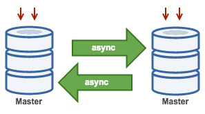

# MySQL v8 Master-Master Replication:

MySQL 8 master-master replication involves configuring two MySQL servers to act as both master and slave to each other. This bidirectional replication allows changes made on either server to be replicated to the other. 




Here are the general steps to set up master-master replication:

## Prerequisites: 
- Two separate physical or virtual servers.
- MySQL 8.x is installed and running on both servers.
- Assign unique server IDs to each MySQL instance.
- Enable binary logging on both servers.
- Create a dedicated MySQL user for replication with the necessary privileges.


## Step-1: Configure MySQL Server-1 (Master-1):

Open the MySQL configuration file on Server-1. This file is typically named "my.cnf" or "my.ini", and its location can vary (common locations include /etc/mysql/my.cnf or /etc/my.cnf). Here is custom location for own purpose.

Add or modify the following lines to the configuration file:


```
[client]
socket = /mysqldb/8.0.34/dbs/data/mysql.sock

[mysqld]

server-id = 1
bind-address = 0.0.0.0
port = 3306

basedir = /mysqldb/8.0.34/mysql-8.0.34
datadir = /mysqldb/8.0.34/dbs/data

log-bin = /mysqldb/8.0.34/dbs/data/mysql-bin.log
#binlog-do-db = your_database_name

socket = /mysqldb/8.0.34/dbs/data/mysql.sock

log-error = /mysqldb/8.0.34/logs/error.log

```


Save the changes and restart the MySQL service:

```
systemctl restart mysql
```


```
netstat -tlpn | grep 3306

tcp        0      0 0.0.0.0:3306     0.0.0.0:*     LISTEN      8491/mysqld
```


## Step-2: Configure MySQL Server-2 (Master-2):

Add or modify the following lines to the configuration file:


```
[client]
socket = /mysqldb/8.0.34/dbs/data/mysql.sock

[mysqld]

server-id = 2
bind-address = 0.0.0.0
port = 3306

basedir = /mysqldb/8.0.34/mysql-8.0.34
datadir = /mysqldb/8.0.34/dbs/data

log-bin = /mysqldb/8.0.34/dbs/data/mysql-bin.log
#binlog-do-db = your_database_name

socket = /mysqldb/8.0.34/dbs/data/mysql.sock

log-error = /mysqldb/8.0.34/logs/error.log

```


Save the changes and restart the MySQL service:

```
systemctl restart mysql
```


```
netstat -tlpn | grep 3306

tcp        0      0 0.0.0.0:3306     0.0.0.0:*     LISTEN      8491/mysqld
```


## Step-3: Create Replication User:

On both Server-1 and Server-2, create a MySQL user for replication. Replace "replicator" and "your_password" with your desired username and password.

```
### Log in to MySQL on the master server-1 and server-2:

mysql -u root -p
```


```
create user 'replicator'@'%' identified with mysql_native_password by 'secret';

grant replication slave on *.* to 'replicator'@'%';

FLUSH PRIVILEGES;
```


```
SHOW GRANTS FOR 'replicator'@'%';
```


```
use mysql;
select user,host,plugin from user;
```


## Step-4: Get the Master Log File and Position:

__On Server-1, get the current master status:__

```
SHOW VARIABLES LIKE 'server_id';

+---------------+-------+
| Variable_name | Value |
+---------------+-------+
| server_id     | 1     |
+---------------+-------+
```


```
show binary logs;

+------------------+-----------+-----------+
| Log_name         | File_size | Encrypted |
+------------------+-----------+-----------+
| mysql-bin.000001 |       157 | No        |
| mysql-bin.000002 |       869 | No        |
+------------------+-----------+-----------+
```


```
SHOW MASTER STATUS;

+------------------+----------+--------------+------------------+-------------------+
| File             | Position | Binlog_Do_DB | Binlog_Ignore_DB | Executed_Gtid_Set |
+------------------+----------+--------------+------------------+-------------------+
| mysql-bin.000002 |      869 |              |                  |                   |
+------------------+----------+--------------+------------------+-------------------+
```


__Repeat on Server-2, get the current master status:__

```
SHOW VARIABLES LIKE 'server_id';
+---------------+-------+
| Variable_name | Value |
+---------------+-------+
| server_id     | 2     |
+---------------+-------+
```


```
show binary logs;
+------------------+-----------+-----------+
| Log_name         | File_size | Encrypted |
+------------------+-----------+-----------+
| mysql-bin.000001 |       157 | No        |
| mysql-bin.000002 |       868 | No        |
+------------------+-----------+-----------+
```


```
SHOW MASTER STATUS;

+------------------+----------+--------------+------------------+-------------------+
| File             | Position | Binlog_Do_DB | Binlog_Ignore_DB | Executed_Gtid_Set |
+------------------+----------+--------------+------------------+-------------------+
| mysql-bin.000002 |      868 |              |                  |                   |
+------------------+----------+--------------+------------------+-------------------+
```


## Step 5: Set up Replication on both Servers:

Replace 'server1_ip' and 'server2_ip', 'replicator', 'password', 'mysql-bin.000002', and 868  with your master's IP, replication user details, and the appropriate log file and position.


__On Server-1:__

```
STOP REPLICA;
```


```
CHANGE REPLICATION SOURCE TO
SOURCE_HOST='server2_ip',
SOURCE_USER='replicator',
SOURCE_PASSWORD='secret',
SOURCE_LOG_FILE='mysql-bin.000002',
SOURCE_LOG_POS=868;
```


```
### Start Replication: 

START REPLICA;
```


__On Server-2:__

```
STOP REPLICA;
```


```
CHANGE REPLICATION SOURCE TO
SOURCE_HOST='server1_ip',
SOURCE_USER='replicator',
SOURCE_PASSWORD='secret',
SOURCE_LOG_FILE='mysql-bin.000002',
SOURCE_LOG_POS=869;

```


```
### Start Replication: 

START REPLICA;
```


## Step-6: Verify Replication:

Check the replication status on both servers:

```
SHOW SLAVE STATUS\G;
```

```
SHOW REPLICAS;
```


__On Server-1:__

```
create database db1;
```

__On Server-2:__

```
create database db2;
```


__On Server-1:__

```
show databases;

+--------------------+
| Database           |
+--------------------+
| db1                |
| db2                |
| information_schema |
| mysql              |
| performance_schema |
| sys                |
+--------------------+

```

__On Server-2:__

```
show databases;

+--------------------+
| Database           |
+--------------------+
| db1                |
| db2                |
| information_schema |
| mysql              |
| performance_schema |
| sys                |
+--------------------+

```


Now, your MySQL 8 master-master replication setup should be operational. Any changes made on one server should be replicated to the other.


